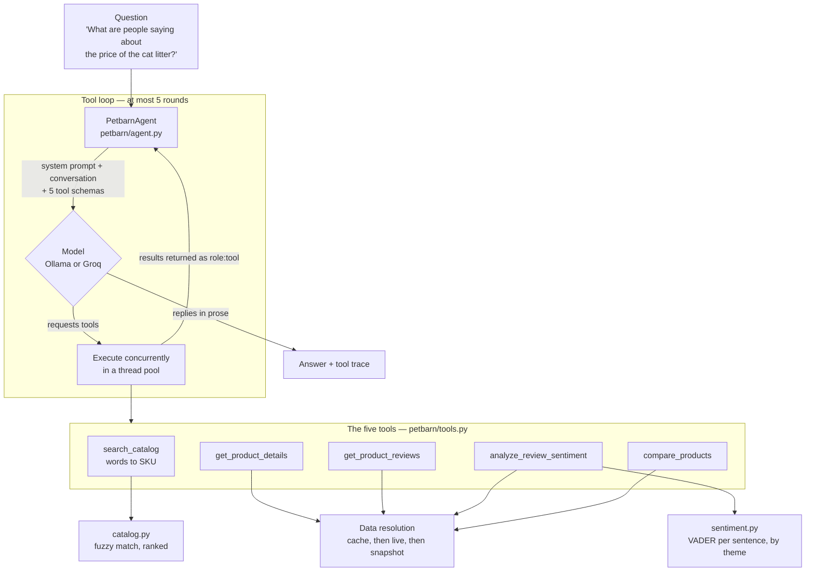
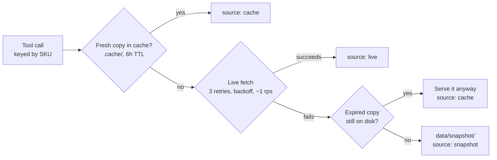
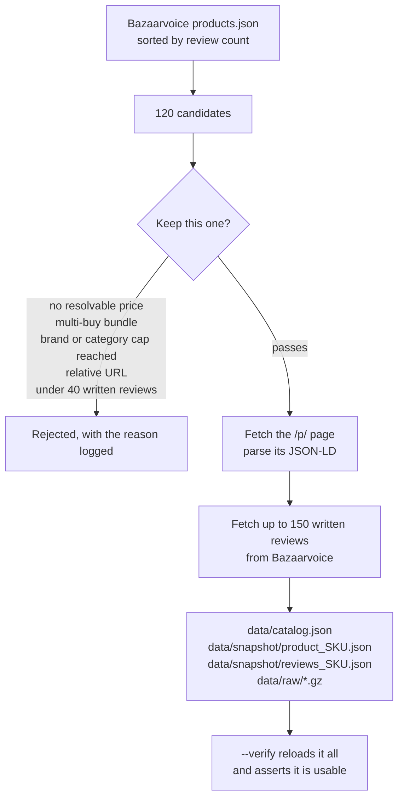

# 🐾 Petbarn Product Assistant

An agentic Streamlit chatbot that answers questions about [Petbarn](https://www.petbarn.com.au)
products by calling tools on demand — scraping product pages and retrieving real customer reviews
while the conversation is happening, rather than answering from a prompt stuffed with data.

It runs **fully offline on a local Ollama model** by default: no API key, no per-request cost, and
nothing leaves the machine. Four hosted backends — **Groq**, **Google Gemini**, **OpenAI** and
**Anthropic Claude** — are one dropdown away, for deployment or for when a bigger model is worth the
round trip.

**Live app:** _<!-- DEPLOY_URL -->deployment pending_

```
"What are people saying about the price and quality of the Breeders Choice cat litter?"
"Can you compare the reviews between the Black Hawk lamb and rice and the Prime100 kangaroo roll?"
"List the main pros and cons based on recent customer feedback for the NexGard Spectra."
```

---

## Quick start (fully offline)

```bash
git clone <this-repo> && cd petbarn-assistant
python -m venv .venv && .venv/Scripts/activate      # macOS/Linux: source .venv/bin/activate
pip install -r requirements.txt
```

Install [Ollama](https://ollama.com/download), then pull a model that can **call tools** — this app
cannot work without tool support:

```bash
ollama pull granite4.1:8b     # ~5GB, best tool calling
ollama pull granite4.1:3b     # ~2GB, fits a 6GB GPU entirely, much faster
streamlit run streamlit_app.py
```

The sidebar lists whatever models you have installed, so both can sit side by side and you can
switch per question. The repo ships with a working dataset, so nothing needs scraping first.

To use a hosted backend instead, pick it in the sidebar and paste a key. Free tiers:
[Groq](https://console.groq.com/keys) and [Google AI Studio](https://aistudio.google.com/apikey).
Or put the matching `<PROVIDER>_API_KEY` in `.streamlit/secrets.toml`.

---

## How it works

The model is given five tools and decides which to call. Nothing about a product reaches an answer
unless a tool returned it during that conversation.



Every tool is keyed by SKU, which is why `search_catalog` is called first: a model left to guess a
SKU invents one. What "data resolution" does is set out under [Reliability](#reliability).

### Model backends

Both are reached through the same **OpenAI-compatible** chat-completions interface, so the agent
loop never learns which one it is talking to. That is also why there is no `groq` SDK dependency —
one client type covers both.

| Backend | Runs | Key | Offline | Env var | Notes |
|---|---|---|---|---|---|
| **Ollama** *(default)* | Your machine | None | **Yes** | — | Free and private; a container can't reach it |
| **Groq** | Hosted | [Free](https://console.groq.com/keys) | No | `GROQ_API_KEY` | Fast, reliable tool use |
| **Google Gemini** | Hosted | [Free](https://aistudio.google.com/apikey) | No | `GEMINI_API_KEY` | Large free tier |
| **OpenAI** | Hosted | [Paid](https://platform.openai.com/api-keys) | No | `OPENAI_API_KEY` | `gpt-5.6-luna` is the cheapest |
| **Anthropic Claude** | Hosted | [Paid](https://console.anthropic.com/settings/keys) | No | `ANTHROPIC_API_KEY` | Official SDK, not a compat shim |

Four of the five needed nothing but a registry entry — no client, no branching in the agent, no new
dependency — because they all speak OpenAI's chat-completions dialect. Gemini was added in one entry
and eight lines of error-message wording.

**Claude is the deliberate exception.** Anthropic publishes an OpenAI-compatible endpoint too, and
using it would have been a one-entry change as well — but it is a compatibility shim with reduced
feature support, and Anthropic's own guidance is to use the real SDK. So Claude goes through the
official `anthropic` client behind `_AnthropicMessagesAdapter`, which translates between the two
message formats. Three differences make that non-trivial, and all three are covered by tests:

- The system prompt is a top-level argument, not a message with a role.
- A tool call is a `tool_use` block on the assistant turn and its result is a `tool_result` block in
  a **user** turn — and all results from one assistant turn must arrive in a *single* user message,
  or the model is trained out of calling tools in parallel.
- `temperature` is rejected outright by current Claude models, so the adapter drops it rather than
  forwarding the agent's default.

The only other provider-specific code anywhere is the wording of error messages: Groq says "invalid
api key", Gemini says "API key not valid", Anthropic says "invalid x-api-key", and each should still
reach the user as one plain sentence.

Two details that matter for the local path:

- **Ollama's default context window is small**, and an overflowing context silently drops the
  *start* of the conversation — including the instructions that keep answers grounded. The app
  requests `num_ctx` explicitly and narrows review payloads to 8 reviews per call for local models
  instead of 25, so a tool result never arrives half-eaten.
- **Model lists are discovered from the running server**, not hard-coded. What is installed is a
  property of your machine, and a baked-in list would start rotting immediately.

### The data sources

Working out where Petbarn's data actually lives was most of the design work, so it is worth
recording what is true of the site:

| What | Where it comes from |
|---|---|
| **Specifications, price, brand** | The **schema.org JSON-LD** embedded server-side in each `/p/<slug>` page. Petbarn's storefront is a Next.js app that assembles most of its markup in the browser, but it publishes complete JSON-LD for search engines. Parsing that is far steadier than scraping rendered HTML, and it includes the **loyalty member price**, availability, barcode, delivery options and return policy. |
| **Customer reviews** | **Bazaarvoice**, the platform Petbarn renders reviews with. Reviews are lazy-loaded client-side, so they are *not* in the page HTML; they come from Bazaarvoice's public display API, keyed by Petbarn's SKU. It returns review text, titles, dates, verified-purchaser badges, helpful votes, the full star distribution, and per-aspect ratings for **Quality**, **Value for money** and **Pet satisfaction**. |
| **Which products to cover** | Bazaarvoice's product listing sorted by review count, which is how `scripts/build_snapshot.py` finds products with enough written feedback to be worth discussing. |

Two traps in the data that the parser handles explicitly:

- **Multi-size products** are published as `@type: "ProductGroup"` with **no price of their own** —
  each entry in `hasVariant` carries its own SKU, size and price. Treating those pages like normal
  products yields a catalog of items with no price.
- **Slugs cannot be guessed.** A plausibly-constructed product URL returns 404. Product URLs come
  from the sitemap or from Bazaarvoice's `ProductPageUrl`, never from string assembly.

There is also a public GraphQL endpoint at `mesh.petbarn.com.au`; it returns **403** to anything
that is not the storefront, and it is not needed.

### The five tools

The brief asks for two. Three more exist because testing showed they measurably improve answers:

| Tool | Purpose |
|---|---|
| `search_catalog` | Turns "the kangaroo roll" into a SKU. Called first, always. Every other tool is keyed by SKU, and a model left to guess a SKU will invent one and then answer confidently about a product that does not exist. Returns *ranked* candidates with confidence scores, so a genuinely ambiguous request becomes a clarifying question instead of a coin flip. |
| `get_product_details` | Specifications, regular and member price, brand, category, size, availability, barcode, description, other sizes, delivery options. |
| `get_product_reviews` | Individual reviews with ratings, dates, verified-purchaser flags and helpful votes, plus the aggregate picture: average, star distribution, recommend rate, and Petbarn's own Quality / Value / Pet-satisfaction averages. Filterable by rating and sortable, so "what do the one-star reviews say" is answerable. |
| `analyze_review_sentiment` | Sentiment broken down by theme, with counts, average stars and verbatim quotes per theme, plus ranked pros and cons. |
| `compare_products` | Two or three products side by side in **one** call. This exists because comparison is the question shape models get half-right: granite4.1:8b resolved both products, analysed only one, and wrote a confident comparison from one side of it. A single atomic call removes the opportunity. |

Payloads are shaped for the model rather than for a machine. Each aspect ships a **pre-written
sentence** (`"Price & value for money: 24 mentions, 23 positive and 1 negative (96% positive),
averaging 4.95 stars."`) because giving a small model figures to combine produced invented ones — a
3B read `positive_share: 0.788` on a 74-mention aspect and wrote "78 of 74 mentions positive".
Ratios were replaced with whole percentages for the same reason, and thin evidence carries an
explicit `weak_evidence` flag rather than being left for the model to infer from a count.

### Sentiment is computed, not guessed

The sample questions ask about sentiment *per theme* — "the price **and** quality of X", "pros and
cons". A single polarity score cannot express that shoppers love a food's quality while calling it
expensive, which is the dominant pattern in this data: Value for money consistently averages below
Quality on almost every product in the catalog.

So `petbarn/sentiment.py` does the analysis itself:

- **VADER** scores polarity sentence by sentence. It is rule-based, so the same review always
  produces the same number, and the reviewer's words drive the result rather than the model's
  impression of them.
- Its lexicon is extended with 43 pet-retail terms VADER lacks (`overpriced`, `clumping`, `dusty`,
  `fussy`, `resealable`, `diarrhoea`…). Terms VADER already scores are left untouched.
- Sentences are bucketed into themes by keyword, so "great food but pricey" counts positively for
  quality and negatively for price.
- **Aspects are gated by product category.** Taste is a real signal for food and a category error
  for cat litter — and keyword tuning cannot fix that, because the words genuinely appear ("my cat
  eats the pellets"). Litter is therefore never measured for palatability at all.
- **Star ratings are reported alongside polarity, never blended into it.** Where the two disagree —
  a five-star review with a specific complaint — that is counted and surfaced as
  `star_vs_text_disagreements` rather than averaged away.
- **A quote must satisfy both signals before it is offered as evidence.** VADER scores
  *"No more runny poos!!"* at −0.42, seeing only the unpleasant noun, so it was being presented as a
  five-star reviewer's complaint. A sentence is only quoted as criticism when the reviewer also
  *rated* the product poorly. Lexicon tuning cannot settle this on its own: *"no longer stocking the
  smaller rolls"* is a genuine complaint in the same construction, and only the star rating tells
  them apart. Quotes are also re-scored after truncation and dropped if the shortened form no longer
  supports the claim.
- **Two genuine gaps in VADER's lexicon are filled.** `issue`/`issues` are simply absent, which
  meant "no issues" had nothing for "no" to negate — so "no" fell back to its own −1.2 valence and a
  sentence meaning *it works fine* scored −0.30. That is how 15 reviews here pay a compliment.
  Double-negative praise ("could not be happier") is corrected the same way, via VADER's idiom
  table.

An aspect needs at least three mentions before it can become a pro or a con, and the thresholds for
the two do not overlap, so an aspect is never presented as both.

The model's job is then to narrate evidence it was handed, with quotes, not to infer sentiment from
a wall of text.

### Reliability

Every tool resolves its data the same way:



1. **A recent local cache** (`.cache/`, 6-hour TTL, keyed by request hash).
2. **A live fetch** through one shared session: 3 retries with exponential backoff, ~1 request per
   second per host, 15-second timeout, realistic user agent.
3. **The snapshot committed to this repo** (`data/snapshot/`) — 10 products and 1,474 real written
   reviews (drawn from 7,616 underlying ratings).

The consequence is that a blocked request, a rotated Bazaarvoice key, a site outage or a host with
no egress degrades the *freshness* of an answer rather than the ability to answer at all. If the
network fails but an expired cache entry exists, the expired entry is served rather than the error.

Which layer served each call travels back in the payload as `source`, is rendered as a badge in the
tool trace, and the assistant is instructed to say so out loud when an answer rests on the snapshot.
Toggle **Fetch live data** off in the sidebar (or set `PETBARN_LIVE=0`) to force the offline path —
combined with Ollama, that makes the whole application work with the network unplugged.

### The agent loop

Tool calls requested together execute concurrently in a thread pool: a capable model asks for both
products' reviews in one round when comparing them, and running those in sequence would double the
wait for nothing. Weaker local models tend to call one tool at a time instead, which the loop
handles identically, just over more rounds.

The loop is bounded at 5 rounds; on the last round the model is asked once more with tools disabled,
which turns a runaway into an answer instead of a timeout. Tool failures are passed back to the
model as tool results so it can tell the user what it could not find out. An empty completion is
replaced with an explanation, because silence in a chat window reads as a crash. Tool messages are
not carried between turns, keeping context small and preventing stale tool output from leaking into
a later question.

---

## Scraping conduct

- Only `/p/` product pages are requested. `robots.txt` permits them, and none of its `Disallow`
  paths are visited.
- Requests are throttled to roughly one per second per host and cached for six hours, so repeated
  questions about the same product generate no traffic at all.
- Review retrieval uses the same public, read-only Bazaarvoice display endpoint the product page
  itself calls from every visitor's browser. The display passkey that authorises it is served in
  Petbarn's own client-side bundle rather than being a private credential; it is
  **re-discovered at runtime** from that bundle (with a last-known value as a fallback and a
  `BV_PASSKEY` override) so a rotation on Petbarn's side does not break the app.
- Nothing is written, submitted or purchased. No accounts, carts or checkout paths are touched.

This is a technical demonstration, not an approved integration. Anything beyond that would want
Petbarn's permission.

---

## Testing

```bash
python scripts/smoke_test.py       # all 5 tools, live + offline — 104 checks, no model needed
python scripts/loop_test.py        # agent loop + Claude adapter, stubbed — 88 checks, no model
python scripts/ui_test.py          # the Streamlit UI via AppTest — 30 checks, no model
python scripts/agent_test.py                         # the brief's questions, through a real model
python scripts/agent_test.py --model granite4.1:3b   # pick a local model
python scripts/agent_test.py --provider groq         # against the hosted backend
python scripts/agent_test.py --offline               # forced onto the snapshot
python scripts/build_snapshot.py --verify            # check the committed dataset is intact
```

The first three need no model and no API key at all, which is deliberate: the parts most likely to
break are the parts that do not involve an LLM.

`smoke_test.py` is the one that matters most. The agent is only as good as the tools beneath it, and
every failure worth guarding against lives there — a scraper that silently returns no price, a
snapshot that cannot satisfy a filter the live API can, a payload missing the provenance the UI
renders.

`loop_test.py` substitutes a scripted model for the real one, because you cannot make a real model
reliably produce the cases worth testing on demand: two tool calls in a single round, malformed tool
arguments, a hallucinated tool name, a request for tools that never stops, an empty completion, an
expired key, and the per-provider request differences. The tools underneath stay real, so it also
proves tool results are packaged into messages the API would accept with their call ids matched up.
It found a live bug — an empty model completion rendered as silence, which reads as a crash.

`ui_test.py` drives the sidebar through Streamlit's `AppTest` harness. It exists because of a bug it
would have caught: the API-key box used one session-state key for every backend, so a key typed for
one provider was handed to whichever provider you switched to next — paste a Gemini key, switch to
Groq, and Groq was sent the Gemini key and rejected it. Both other suites stayed green throughout,
because the fault was entirely in widget state and nothing exercised it. Each backend now has its own
keyed widget, and each remembers its own key for the session.

`agent_test.py` covers what none of them can: whether the *model* picks the right tools. It prints the
full trace per question, including the cases a demo tends to trip on — an off-catalog product, a
request for only the critical reviews, and a bare "what can you help me with".

### Re-ingesting the data

```bash
python scripts/build_snapshot.py             # rebuild catalog + snapshot from the live site
python scripts/build_snapshot.py --count 12  # a different catalog size
```

Products are selected mechanically rather than by hand, which is what produces a catalog spanning 10
brands and 6 categories instead of ten variants of the same flea chew:



Raw responses are archived gzipped under `data/raw/` so the parsers can be re-run and audited
without touching the network.

---

## Deployment (Streamlit Community Cloud)

A hosted container cannot reach an Ollama server on your laptop, so the deployed app runs on Groq.
The backend is a config value, not a code change.

1. Push this repo to a **public** GitHub repository.
2. At [share.streamlit.io](https://share.streamlit.io): **New app** → select the repo → main file
   `streamlit_app.py` → **Advanced settings → Python 3.12**.
3. In **Settings → Secrets**, add a key for whichever hosted backend you want:
   ```toml
   GROQ_API_KEY = "gsk_..."          # or GEMINI_API_KEY / OPENAI_API_KEY / ANTHROPIC_API_KEY
   ```
4. Deploy, then put the public URL at the top of this file.

The backend does not need to be named: with no Ollama server reachable and a key
present, the app opens on the hosted backend by itself. Setting
`PETBARN_PROVIDER = "groq"` alongside the key pins it explicitly and always wins.

Visitors can still paste their own key in the sidebar, which spends their quota rather than yours —
useful when a free tier runs dry.

`.cache/` is ephemeral on a hosted container, which is expected: the snapshot is the durable
fallback, not the cache.

---

## Project layout

```
streamlit_app.py            Chat UI, backend picker, tool-trace rendering
petbarn/
  config.py                 Endpoints, tuning, env overrides — no magic strings elsewhere
  models.py                 Dataclasses shared by every layer; JSON round-trips both ways
  textutils.py              Text repair (Petbarn's copy contains stray U+0092 control chars)
  http.py                   One session: retries, throttling, disk cache, stale-while-broken
  scraper.py                Product page → JSON-LD → ProductDetails (Product + ProductGroup)
  reviews.py                Bazaarvoice client + runtime passkey discovery
  sentiment.py              VADER + retail lexicon + aspect mining → pros and cons
  catalog.py                Curated catalog and fuzzy "what did they mean" → SKU
  tools.py                  Tool schemas, payload shaping, the 3-layer fallback chain
  llm.py                    Provider registry: 5 backends + the Claude adapter, one interface
  agent.py                  Tool loop: parallel calls, bounded rounds, trace capture
data/
  catalog.json              The 10 curated products
  snapshot/                 Offline fallback: product + review JSON per SKU
  raw/                      Gzipped raw HTML and API responses, for auditing
scripts/
  build_snapshot.py         Ingestion and dataset verification
  smoke_test.py             Tool-level tests, live and offline (no model needed)
  loop_test.py              Agent-loop tests against a stubbed model (no model needed)
  ui_test.py                Streamlit UI tests via AppTest (no model needed)
  agent_test.py             End-to-end tests through a real model
```

---

## Limitations

- **Only Ollama and Groq have been exercised end to end.** OpenAI, Gemini and Anthropic are wired up
  and their request/response translation is covered by tests, but I had no keys for them, so no real
  answer has been generated through those three. The Claude adapter in particular deserves a live
  run before it is relied on.
- **Small local models are the weak link.** The tools are deterministic; the choice of which to call
  is not. On this 6GB laptop GPU `granite4.1:3b` answers in 10-20 seconds, while `granite4.1:8b`
  takes 70-90 because it partly spills to CPU — and it is not uniformly better: the 8B chose
  `max_rating` correctly first try where the 3B did not, but the 3B fetched both products for a
  comparison where the 8B fetched one.

  Every error observed during testing was met with a structural fix rather than a prompt plea: a
  price lifted from a review's text led to unambiguous field names and an explicit prohibition; a
  ratio misread as a count led to pre-written summary sentences; a half-finished comparison led to
  `compare_products`; `min_rating=1` used to mean "one-star reviews" led to worked examples in the
  schema. A larger model still handles all of this more reliably, which is what the Groq option is
  for. The UI flags any answer produced with no tool calls at all.
- **Ten products.** `search_catalog` says so plainly and lists what it does cover rather than
  improvising. Widening it is a matter of re-running the ingestion with a larger `--count`.
- **No stock, order or delivery data**, and no veterinary advice — the assistant is instructed to
  refer those to a vet.
- **Review coverage is capped** at 150 written reviews per product. On a product with 1,200+
  reviews, sentiment describes a recent sample rather than the entire history; the tool reports how
  many it analysed so the answer can be honest about it.
- **Aspect matching is keyword-based**, so a sentence can still land in the wrong theme within an
  applicable category — "waste of money" in a review praising a *different* brand reads as a price
  complaint. Quotes are returned with every finding precisely so a reader can judge for themselves.
- **Answers are not streamed.** The tool loop needs each round's result before the next.
